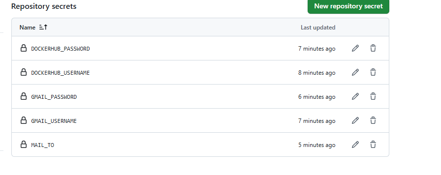
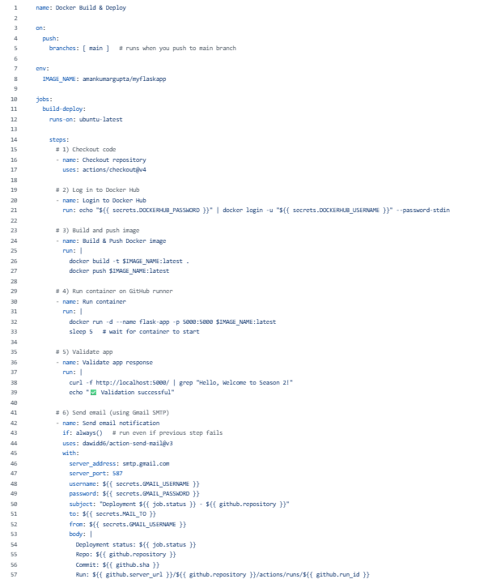
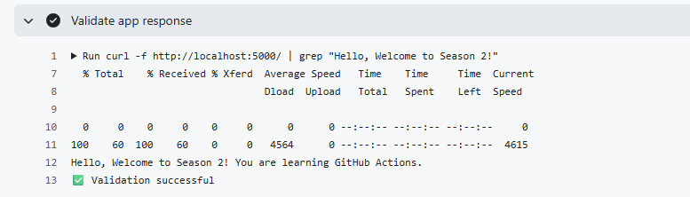
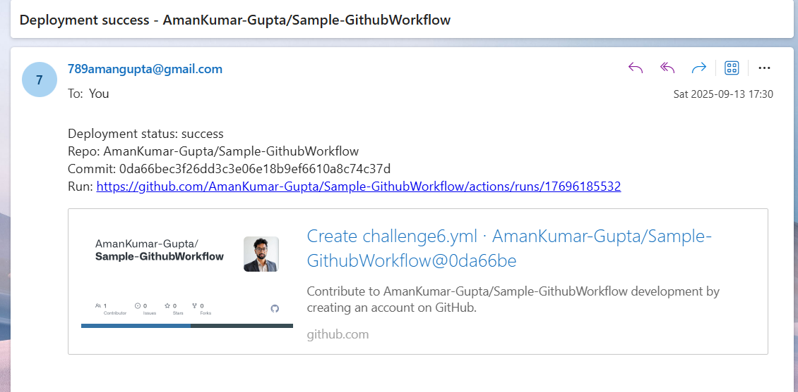

# Season 2 Day 6 Challenge - Solution

---

## Theory Answers

### Q1: What are the key differences between GitHub Actions and Jenkins?

Both are CI/CD tools, but they differ in simplicity, integration, and control:

- **Simplicity:** GitHub Actions is easier to start with. You just write a YAML file inside the `.github/workflows` folder, and it runs automatically. Jenkins requires more setup and configuration.
- **Integration:** GitHub Actions is natively integrated with GitHub, so it works seamlessly with repositories, pull requests, and events. Jenkins is external and needs to be connected manually.
- **Cost:** GitHub Actions is free when using GitHub-managed runners (with certain limits). If you need more control, you can use self-hosted runners, similar to how Jenkins agents work.
- **Language:** GitHub Actions uses YAML syntax, while Jenkins pipelines are written in Groovy.
- **Scalability & Control:** GitHub Actions is managed by GitHub, which makes scaling easier. Jenkins gives you more control but also requires you to manage and maintain the servers.

---

### Q2: Describe the general structure of a GitHub Actions workflow.

A GitHub Actions workflow follows this structure:

```yaml
name: Name of the workflow
on:        # Defines when the workflow runs (e.g., push, pull_request, schedule, workflow_dispatch)
jobs:      # Contains one or more jobs
  job_id:
    runs-on: ubuntu-latest  # Defines the runner
    steps:                  # Defines the tasks within a job
      - name: Step name
        uses: actions/checkout@v4  # Calls an external GitHub Action
      - name: Run custom script
        run: echo "Hello, GitHub Actions!"  # Runs shell commands
```

**Key elements:**

- `name` → Workflow name
- `on` → Trigger conditions (push, PR, schedule, manual, etc.)
- `jobs` → Collection of tasks to execute
- `steps` → Individual commands or actions within a job
- `uses` → Run an existing action from GitHub Marketplace
- `run` → Execute custom shell commands or scripts

---

### Q3: How to manage variables and secrets in GitHub Actions?

Managing variables and secrets is simple:

Go to **Repository → Settings → Secrets and variables → Actions**.

Here you can create:

- **Secrets** → For sensitive data (e.g., API keys, passwords).
- **Variables** → For non-sensitive values (e.g., environment names).

In workflows, reference them like:

```yaml
env:
  MY_VAR: ${{ vars.MY_VARIABLE }}
  MY_SECRET: ${{ secrets.MY_SECRET_KEY }}
```

This ensures sensitive values remain secure and not exposed in plain text.

---

# Practical Challenge Solution


## 1. Set Up Repository & Secrets

- Created a GitHub repository called `Sample-GithubWorkflow` with these files:
  - `app.py` (Flask app)
  - `Dockerfile` (for containerizing the app)
- Added secrets in GitHub under **Settings → Secrets and variables → Actions**:
  - `DOCKERHUB_USERNAME`
  - `DOCKERHUB_PASSWORD`
  - `GMAIL_USERNAME`
  - `GMAIL_PASSWORD`
  - `MAIL_TO`




## 2. Write GitHub Actions Workflow

- Created a workflow file at `.github/workflows/challenge6.yml`.




## 3. Build & Push Docker Image

- When code was pushed, the workflow built a Docker image and pushed it to Docker Hub.


## 4. Deploy on GitHub Runner

- The GitHub runner pulled the image from Docker Hub and started a container.


## 5. Validate Application

- Once the container was running, checked the app with:

```bash
curl http://localhost:5000/
```

**Expected output:**

```
Hello, Welcome to Season 2! You are learning GitHub Actions.
```




## 6. Email Notification

- At the end, the workflow sent an email with the deployment status and a link to the workflow run.

