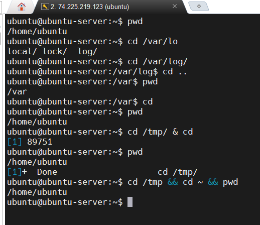

# Season 2 Day 7 Challenge - Solution

---

## Theory Answers

## 1. `/var` Directory Purpose
`/var` stores variable data that changes during system operation (logs, cache, temp files). It's often on a separate device to prevent it from filling up the root filesystem and crashing the system.

## 2. Absolute vs Relative Paths
- **Absolute path**: Starts from root `/` - `/home/user/docs`
- **Relative path**: From current location - `../../home/user/docs` (from `/usr/share`)

## 3. Wildcards `ls f[io]le*`
Will list: `file1` and `file3`
- `[io]` matches either `i` or `o`
- `*` matches anything after
- Won't match `fole2` (has `o` but wrong position) or `flea` (doesn't match pattern)

## 4. `chmod 640` Permissions
- Owner: read + write (6 = 4+2)
- Group: read only (4)
- Others: no access (0)

## 5. `/home` with `noexec`
Prevents executing programs from `/home` directory. Security measure to stop users from running potentially malicious executables from their home folders.

## 6. `cp -a` vs `cp -r`
- `cp -r`: Just recursive copy
- `cp -a`: Archive mode - preserves permissions, timestamps, ownership, and symbolic links

## 7. Hard vs Symbolic Links
- **Hard link**: Direct pointer to file data on disk
- **Symbolic link**: Points to file path (like a shortcut)
- Hard link to `/etc/passwd` fails because it's usually on a different filesystem than home directory

## 8. `>>` vs `>` Redirection
- `>>` appends to file (adds to end)
- `>` overwrites file (replaces content)

## 9. Mount Commands Comparison
- `mount`: Shows mounted filesystems
- `df -h`: Shows disk space usage (**use this for available space**)
- `findmnt`: Shows mount points in tree format

## 10. SGID Bit Effect
Files created in SGID directory inherit the group ownership of the parent directory instead of the user's primary group.

# Practical Challenge Solution

## Task 1 — Infiltrate the Filesystem (as ubuntu)

1. I ran `pwd` to confirm my starting point (expected `/home/ec2-user`, but I used `/home/ubuntu`).
2. I entered `/var/log` using an absolute path: `cd /var/log`.
3. I retreated one level with a relative move: `cd ..` (now in `/var`).
4. I returned home with the shortcut: `cd` (no args).
5. I visited `/tmp` and immediately came back with one command that runs in sequence (not background): `cd /tmp && cd ~ && pwd`.

**Tips to remember:**

* `cd` with no arguments always returns me to my home `~`.
* Use `&&` to chain commands so the second runs only if the first succeeds.
* Don’t background `cd` with `&` because background jobs can't change the current shell directory.

---

## Task 2 — Set Up the Hideout (as ubuntu)

1. I moved to my home: `cd ~`.
2. I created the vault and subdirectories in one line: `mkdir -p ~/heist_vault/{newfiles,oldfiles}`.
3. I created the hidden file and decoy inside `newfiles`:

   * `touch ~/heist_vault/newfiles/.secret`
   * `touch ~/heist_vault/newfiles/decoy.txt`
4. I secured `newfiles` so only I can access it: `chmod 700 ~/heist_vault/newfiles`.
5. I verified permissions and contents with:

   * `ls -ld ~/heist_vault/newfiles`
   * `ls -a ~/heist_vault/newfiles`

**Tips to remember:**

* A filename starting with `.` is hidden in directory listings unless I use `-a`.
* `chmod 700` gives me full access and denies group/others — good for private directories.

---

## Task 3 — Secure the New Vault — Storage (root actions, Azure)

**Pre-check (I always run this first):**

* `sudo lsblk -o NAME,SIZE,FSTYPE,MOUNTPOINT,LABEL` to identify devices
* `sudo df -h` to see mount points

### Option A: Attach a real Azure 1 GiB managed disk

1. In Azure portal I added a new 4 GiB data disk to my VM (VM → Disks → Add data disk → Create and attach).
2. Inside the VM I found the new device (example): `sudo lsblk` and noticed `/dev/sdb` (size \~1G).
3. I partitioned it with `fdisk`:

   * `sudo fdisk /dev/sdb` → `n` → `p` → `1` → accept defaults → `w`.
4. I told the kernel to re-read partitions: `sudo partprobe /dev/sdb` (or reboot if needed).
5. I formatted the partition: `sudo mkfs.ext4 /dev/sdb`.
6. I mounted it at `/data`:

   * `sudo mkdir -p /data`
   * `sudo mount /dev/sdb /data`
   * `sudo chown ubuntu:ubuntu /data` (so my user can write)
7. I verified with:

   * `df -h /data`
   * `sudo lsblk -o NAME,SIZE,FSTYPE,MOUNTPOINT`

**Tips to remember:**

* Always run `lsblk` before `fdisk` to identify the correct device — avoid wiping the root disk.
* If partition nodes don’t appear after `fdisk`, use `partprobe` or reattach with `losetup -fP`.

---

## Task 4 — Advanced File Ops Under Pressure (ubuntu user)

### Part A — work inside `heist_vault/oldfiles`

1. I changed into the oldfiles folder: `cd ~/heist_vault/oldfiles`.
2. I copied everything (including hidden) from `newfiles` into `oldfiles`:

   * `cp -a ../newfiles/. .`  (this copies dotfiles correctly)
3. I removed any nested `newfiles` directory if it appeared: `rm -rf newfiles`.
4. To copy only visible files I used: `cp -a ../newfiles/* .`.
5. To copy hidden files separately I used: `cp -a ../newfiles/.[!.]* .`.
6. I verified with `ls -la .`.

### Part B — projects and houses

1. I created project files: `mkdir -p ~/projects` and `touch ~/projects/house{1..9}`.
2. I listed only house files: `ls -d ~/projects/house*`.
3. I built the houses tree and added files:

   * `mkdir -p $HOME/projects/houses/doors`
   * `echo "bungalow" > $HOME/projects/houses/bungalow.txt`
   * `echo "bifold door" > $HOME/projects/houses/doors/bifold.txt`
   * `mkdir -p $HOME/projects/outdoors/vegetation`
   * `echo "landscape" > $HOME/projects/outdoors/vegetation/landscape.txt`
4. I copied `house1` and `house5` into `houses/`: `cp -a ~/projects/house1 ~/projects/house5 ~/projects/houses/`.
5. I tried to copy `/usr/share/doc/initscripts*` into projects if it exists with a safe check.
6. I inspected projects recursively with paging: `ls -R ~/projects | less`.
7. I deleted house6..house8 non-interactively: `rm -f ~/projects/house{6..8}`.
8. I moved house3 and house4 to doors/: `mv ~/projects/house3 ~/projects/house4 ~/projects/houses/doors/`.
9. I removed the doors/ directory and contents: `rm -rf ~/projects/houses/doors`.
10. I set house2 permissions to `640`: `chmod 640 ~/projects/house2` and checked `ls -l ~/projects/house2`.
11. I recursively removed write access for everyone: `chmod -R a-w ~/projects` (note: this removes owner write too).

**Tips to remember:**

* `cp -a ../newfiles/. .` is the safest way to copy all contents including dotfiles.
* Brace expansion `house{1..9}` quickly creates a sequence of files.
* Be careful with `chmod -R a-w` — I might lose ability to edit files unless I restore write permissions.

**Screenshot**

* `ls -l ~/projects/house2` (should show `-rw-r-----` i.e., `640`).
* `ls -R ~/projects` (capture a page in `less` showing tree without `doors/`).

---

## Task 5 — Agent Collaboration (root + users)

1. As root I created a new group: `sudo groupadd agents`.
2. I created users with homes and added them to `agents`:

   * `sudo useradd -m -s /bin/bash -G agents alice`
   * `echo "alice:Password123" | sudo chpasswd` (replace with a secure password).
   * `sudo useradd -m -s /bin/bash -G agents bob`
   * `echo "bob:Password123" | sudo chpasswd`.
3. I created the shared directory and set group and permissions with SGID:

   * `sudo mkdir -p /data/shared_space`
   * `sudo chgrp agents /data/shared_space`
   * `sudo chmod 2770 /data/shared_space` (rwx for owner and group, no access for others, and `g+s` set).
4. I created files as the users to confirm collaboration:

   * `sudo -u alice bash -c 'echo "alice here" > /data/shared_space/alice_file.txt'`
   * `sudo -u bob bash -c 'echo "bob here" > /data/shared_space/bob_file.txt'`
5. I verified with:

   * `ls -l /data/shared_space`
   * `ls -ld /data/shared_space` (shows `drwxrws---`).

**Tips to remember:**

* `chmod 2770` sets SGID (the leading 2) so new files inherit the directory group.
* Use `sudo -u username` to run commands as another user for testing.

---

## Task 6 — Cover Your Tracks with Links (ubuntu)

1. I attempted to hard-link `/etc/passwd` to `~/passwd_hard` (often denied): `ln /etc/passwd ~/passwd_hard` and captured the error if present.
2. I created a soft-link for passwd: `ln -s /etc/passwd ~/passwd_link`.
3. I soft-linked `/etc/hosts` into my home: `ln -s /etc/hosts .` (creates `./hosts -> /etc/hosts`).

In `heist_vault`:
4\. I created `evidence.txt`: `echo "the secret evidence" > ~/heist_vault/evidence.txt`.
5\. I hard-linked it: `ln ~/heist_vault/evidence.txt ~/heist_vault/evidence_copy` and checked `ls -l` (link count 2).
6\. I soft-linked it: `ln -s evidence.txt ~/heist_vault/evidence_sym`.
7\. I deleted the original: `rm ~/heist_vault/evidence.txt`.
8\. I tested: `cat ~/heist_vault/evidence_sym` (broken), `cat ~/heist_vault/evidence_copy` (works).
9\. I restored `evidence.txt` from the hard link: `ln ~/heist_vault/evidence_copy ~/heist_vault/evidence.txt`.
10\. I verified with `ls -l ~/heist_vault` and confirmed link count 2 and `evidence_sym` pointing to `evidence.txt`.

**Tips to remember:**

* Hard links point to the same inode; they still work after the original name is removed.
* Soft links point to a pathname; if the target is removed, the symlink breaks.
* You can’t create a hard link across filesystems.

---

## Task 7 — Archive the Loot (root)

1. As root I archived `/etc` uncompressed: `sudo tar -cf /root/etc.tar /etc`.
2. I checked the type: `sudo file /root/etc.tar`.
3. I compressed it with gzip: `sudo gzip /root/etc.tar` → `/root/etc.tar.gz`.
4. I listed contents with `sudo tar -tvf /root/etc.tar.gz | head -n 40`.
5. I extracted `/etc/hosts` into `/root` preserving path: `sudo tar -xvf /root/etc.tar -C /root etc/hosts` (or from gz after gunzip).
6. I confirmed the file exists: `ls -R /root/etc/ | grep hosts` and `ls -l /root/etc/hosts`.
7. I decompressed `etc.tar.gz` if needed with `sudo gunzip /root/etc.tar.gz`.
8. I extracted `/etc/passwd` into `/tmp` with path preserved: `sudo tar -xvf /root/etc.tar -C /tmp etc/passwd` and checked `ls -l /tmp/etc/passwd`.
9. I created a bzip2 archive of `/home`: `sudo tar -cjf /root/homes.tar.bz2 /home`.
10. I cleaned up archives from `/root` when done: `sudo rm -f /root/etc.tar /root/etc.tar.gz /root/homes.tar.bz2`.

**Tips to remember:**

* `tar -cf` creates an uncompressed archive; `gzip` or `bzip2` compresses it.
* Use `-C` with `tar` to extract into a directory and preserve internal paths.

---

## Task 8 — Root Shell Heist (student → root)

1. From my normal account I escalated: `sudo -i` (now root).
2. I archived `/home` and `/etc` into `/root/essentials.tar`: `tar -cf /root/essentials.tar /home /etc`.
3. I copied it to `/tmp`: `cp /root/essentials.tar /tmp/essentials.tar`.
4. I hard-linked it to `/essentials.tar`: `ln /root/essentials.tar /essentials.tar`.
5. I renamed that hard-link to `/archive.tar`: `mv /essentials.tar /archive.tar`.
6. I created a soft-link from `/root/link.tar` to `/archive.tar`: `ln -s /archive.tar /root/link.tar`.
7. I deleted `/archive.tar`: `rm /archive.tar` — now `/root/link.tar` is a broken symlink.
8. I optionally removed the broken link: `rm /root/link.tar`.
9. I compressed `/root/essentials.tar` with gzip: `gzip /root/essentials.tar` creating `/root/essentials.tar.gz`.

**Tips to remember:**

* Hard links keep the data available even if one filename is removed.
* Removing the last hard-linked name removes the inode and frees space.
* Removing the target of a symlink leaves a broken symlink pointing to a non-existent path.

