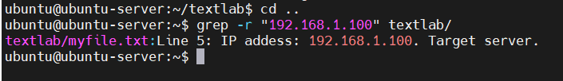
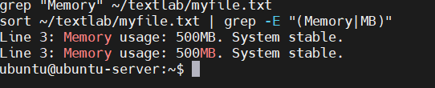
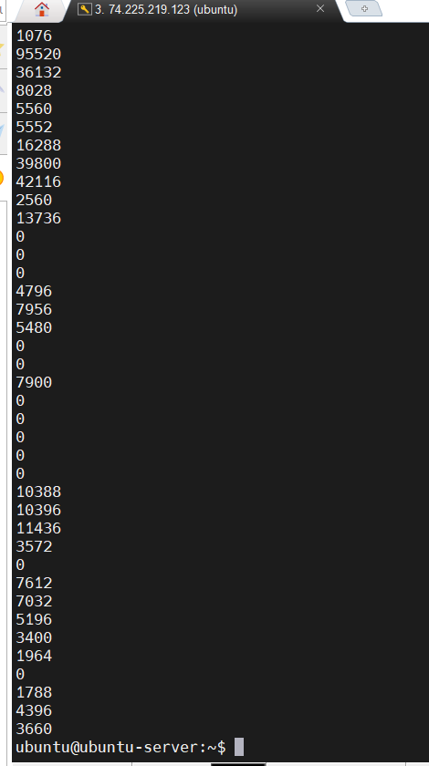
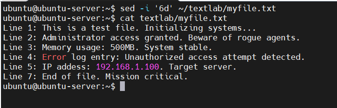
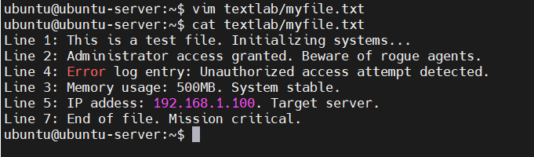
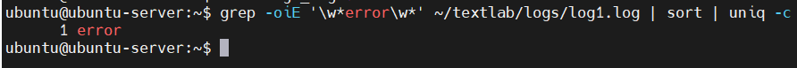

# Season 2 Day 11 Challenge - Solution
---
## ✅ Task 1: Show Line 5 — Two Easy Ways

### 🧰 Method 1 — `sed` (Super Simple)
```bash
sed -n '5p' ~/textlab/myfile.txt
```
✅ *Remember: “5p = print line 5” + `-n` to silence everything else.*

### 🧰 Method 2 — `head` + `tail` (No Brain Required)
```bash
head -5 ~/textlab/myfile.txt | tail -1
```
✅ *Remember: “Head gives top 5, tail grabs last one → that’s line 5!”*


> 💡 **Why it sticks**: You’re using tools you already know. No new syntax. Just chain ‘em.

---

## ✅ Task 2: Find Files with “192.168.1.100”

### 🧰 One-Liner Magic
```bash
grep -r "192.168.1.100" ~/textlab/
```
✅ *Remember: `-r` = recursive. Just grep the whole folder. Done.*



---

## ✅ Task 3: Undo “root” → Back to “Administrator”

### 🧰 Fix It In-Place
```bash
sed -i 's/root/Administrator/g' ~/textlab/myfile.txt
```
✅ *Remember: `s/old/new/g` + `-i` to save directly. The `g` catches all if repeated.*


---

## ✅ Task 4: Sort by Memory (Largest First)

### 🧰 Quick & Dirty Sort
```bash
sort -k3 -nr ~/textlab/myfile.txt
```
✅ *Remember: `-k3` = 3rd word (where “500MB” lives), `-n` = number, `-r` = reverse (biggest on top).*


---

## ✅ Task 5: Extract 6th Column from `ps aux`

### 🧰 Straight to the Point
```bash
ps aux | awk '{print $6}'
```
✅ *Remember: `awk '{print $N}'` — N is the column number. Easy peasy.*


---

## ✅ Task 6: Delete the Password Line (Line 6)

### 🧰 One Command Wipe
```bash
sed -i '6d' ~/textlab/myfile.txt
```
✅ *Remember: `6d` = delete line 6. `-i` saves it. Gone forever. Handle with care.*


---

## ✅ Task 7: Swap Lines 3 and 4 (Bonus Simplicity)

### 🧰 Use `vim` — Muscle Memory Edition
```bash
vim ~/textlab/myfile.txt
```
Then inside vim:
```
:3    → go to line 3
dd    → cut it
:4    → go to line 4
p     → paste after (now line 4 becomes old line 3)
:3    → go back to line 3 (which is now old line 4 content)
dd    → cut it
:2    → go to line 2
p     → paste after → now lines 3 & 4 are swapped!
:wq   → save and quit
```

---

## ✅ Task 8: Archive Logs >1MB

### 🧰 Find + Tar Combo
```bash
find ~/textlab/logs -name "*.log" -size +1M -exec tar -czf large_logs.tar.gz {} +
```
✅ *Remember: `find ... -size +1M` → big logs. `-exec tar ... {} +` → bundle ‘em up.*

---

## ✅ Task 9: Count “error” Words (Case-Insensitive)

### 🧰 Grep + Sort + Uniq Trio
```bash
grep -oi "error" ~/textlab/logs/log1.log | sort | uniq -c
```

---

## ✅ Task 10: Find “password” + Email Alert

### 🧰 Highlight + Mail Quickie
```bash
grep --color=always -i "password" ~/textlab/myfile.txt
echo "ALERT: Password found in myfile.txt" | mail -s "SECURITY!" $USER
```
---

## 🧠 VERY IMPORTANT THINGS TO REMEMBER (Future You Will Thank Present You)

### 🔥 Core Tools & Their Superpowers

| Tool  | What It Does                     | Quick Mnemonic                     |
|-------|----------------------------------|------------------------------------|
| `grep` | Find text anywhere               | “**G**lobally **R**egular **E**xpression **P**rint” — but just think “**find stuff**” |
| `sed`  | Edit text streams                | “**S**tream **ED**itor” — `s/old/new/` is your bread and butter |
| `awk`  | Extract columns / process data   | `awk '{print $N}'` — N = column number. That’s 90% of what you need. |
| `sort` | Sort lines                       | `-k3 -nr` = sort 3rd field, numeric, reverse. Memorize this combo. |
| `find` | Find files by name/size/type     | `find . -name "*.log" -size +1M` — your log-hunting BFF |


### 🎯 Real-World Use Cases You’ll Actually Use

- `grep -r "ERROR" /var/log/` → Find all errors in logs
- `ps aux | awk '{sum+=$6} END {print sum}'` → Total memory used by processes
- `sed -i 's/localhost/production-server/g' config.conf` → Bulk config update
- `find /backups -name "*.log" -mtime +30 -delete` → Auto-clean old logs
- `grep -i "fail\|error\|denied" auth.log` → Security audit in 1 line