# Season 2 Day 12 Challenge - Solution

---

## 📁 Phase 1: Setup & Initial Assessment

### ✅ Task 1: Create Workspace
```bash
mkdir ~/processlab && cd ~/processlab
```
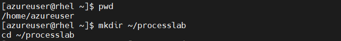
---

### ✅ Task 2: Install Tools (if needed)
```bash
sudo dnf install -y python3 procps-ng sysstat
```
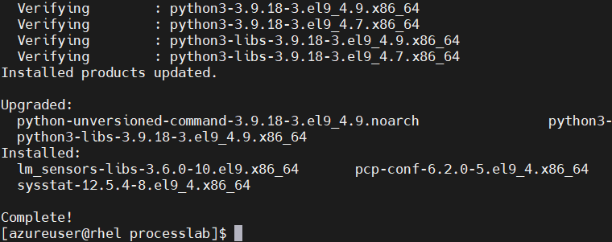
---

### ✅ Task 3: Create Crisis Scripts
```bash
echo 'while true; do :; done' > cpu_hog.sh
echo 'python3 -c "while True: a = [0] * 1000000"' > mem_hog.sh
echo 'sleep 3600' > sleeper.sh
chmod +x *.sh
```
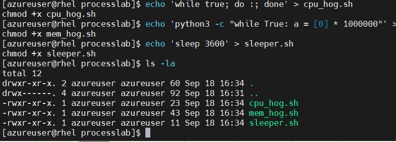
---

## 📊 Phase 2: Initial System Snapshot

### ✅ Task 4: Check Load
```bash
uptime > load.txt && cat load.txt
```
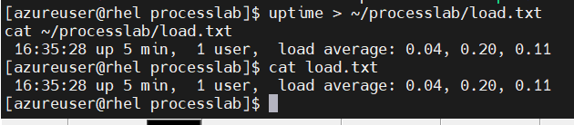

> 💡 **Remember This!**  
> Load averages = how busy your CPU has been over 1, 5, 15 mins.  
> >1 per core = getting busy. >2 = stressed.

---

### ✅ Task 5: CPU Info
```bash
lscpu | grep "^CPU(s):"
```

> More cores = more things can run at once. Load average should be compared to core count.

---

### ✅ Task 6: Snapshot All Processes
```bash
ps aux > all_processes.txt
head -10 all_processes.txt
```
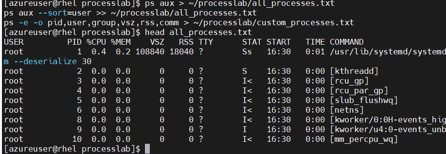

> 💡 **Remember This!**  
> `ps aux` = show ALL processes, from ALL users.  
> `USER`, `%CPU`, `%MEM`, `COMMAND` — these are your new best friends.

---

## 💥 Phase 3: Create the Crisis

### ✅ Task 7: Start Background Hogs
```bash
./cpu_hog.sh & ./mem_hog.sh & ./sleeper.sh &
```
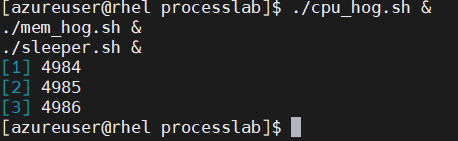

> 💡 **Remember This!**  
> `&` = run in background. You get your prompt back immediately.  
> Job numbers = %1, %2… PIDs = actual process IDs.

---

### ✅ Task 8: Suspend a Foreground Hog
```bash
./cpu_hog.sh
# Then press Ctrl+Z
```
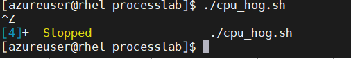

---

## 🎛️ Phase 4: Job Control Magic

### ✅ Task 9: List & Resume Jobs
```bash
jobs
bg %4   # replace 4 with your suspended job number
```
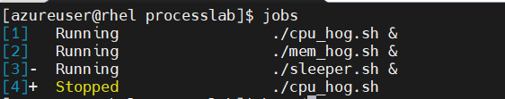

> 💡 **Remember This!**  
> `jobs` = show your shell’s job list.  
> `bg %N` = send job N to background running.  
> `fg %N` = bring job N to foreground.

---

### ✅ Task 10: Kill a Foreground Job
```bash
fg %3   # bring it forward
# Then press Ctrl+C
jobs    # confirm it’s gone

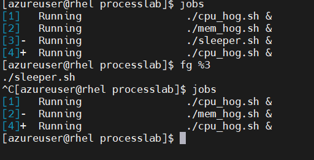
---

## 🔍 Phase 5: Real-Time Monitoring & Killing

### ✅ Task 11: Use `top`
```bash
top
# Press P (sort by CPU), then M (sort by MEM)
```
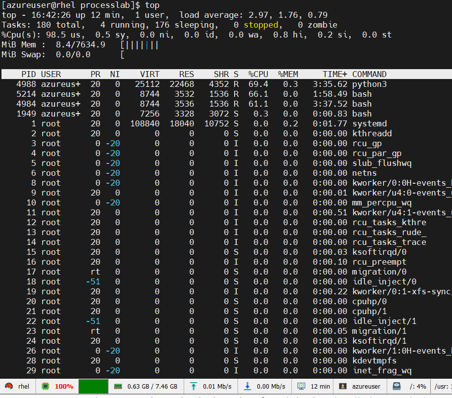

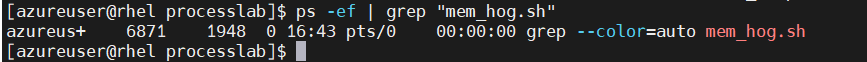

> 💡 **Remember This!**  
> `top` is your live dashboard.  
> `P` = CPU sort, `M` = MEM sort, `q` = quit.  
> Look for COMMAND column to find your rogue scripts.

---

### ✅ Task 12: Kill from `top`
```bash
# In top: press k → type PID → type 15 → Enter → q to quit
---

## 🎚️ Phase 6: Priority Tuning

### ✅ Task 13: Find CPU Hog PID
```bash
ps aux | grep cpu_hog
```
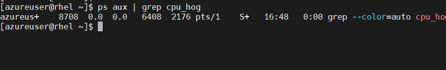

> 💡 **Remember This!**  
> `grep` filters output. Always double-check you’re killing the right thing.

---

### ✅ Task 14: Change Priority
```bash
renice 5 -p 1234           # lower priority
sudo renice -5 -p 1234     # higher priority (needs sudo)
```
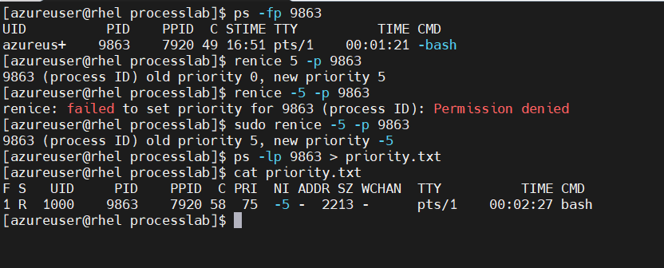

> 💡 **Remember This!**  
> Nice values: -20 (highest) to +19 (lowest).  
> Only root can set negative nice values.  
> Lower nice = higher priority. Yes, it’s backwards. Blame Unix.

---

### ✅ Task 15: Verify Priority
```bash
ps -lp 1234
```
> 💡 **Remember This!**  
> `ps -l` = long format. NI = nice value. PRI = kernel priority (don’t touch that).

---

## 🌳 Phase 7: Process Tree View

### ✅ Task 16: Show Hierarchy
```bash
ps fax | grep -B5 cpu_hog
```
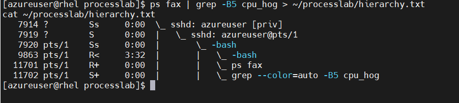

> 💡 **Remember This!**  
> `ps fax` = forest view (tree).  
> `-B5` = show 5 lines BEFORE match — helps see parent processes.  
> Orphaned processes get adopted by `init` (PID 1).

---

## 🧹 Phase 8: Cleanup & Orphan Hunt

### ✅ Task 17: Create Orphaned Process
```bash
# In NEW terminal:
cd ~/processlab
./cpu_hog.sh &
exit

# Back in original terminal:
ps aux | grep cpu_hog
```


> 💡 **Remember This!**  
> When a parent dies, child becomes orphan → adopted by `init`.  
> Orphans aren’t zombies! Zombies are dead processes waiting to be reaped.

---

### ✅ Task 18: Mass Kill by Name
```bash
killall -15 cpu_hog.sh
ps aux | grep cpu_hog   # should show nothing (or just the grep itself)
```
> 💡 **Remember This!**  
> `killall NAME` = kill all processes with that name.  
> Safer than `pkill` if you’re unsure — `killall` is more literal.

---

## 📈 Phase 9: Final Check & Notes

### ✅ Task 19: Compare Load Before/After
```bash
uptime >> load.txt
cat load.txt
```
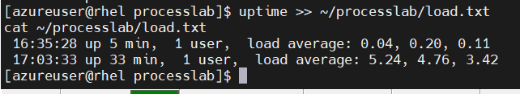

> 💡 **Remember This!**  
> If load doesn’t drop after killing hogs, something’s still running. Double-check!

## 🗃️ Phase 10: Final Proof

### ✅ Task 21: Show All Files
```bash
ls -la
```
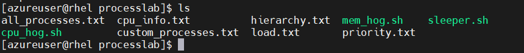

---

### ✅ Task 22: Verify System Health
```bash
uptime
free -h
---

## 🧠 Cheat Sheet: Things to Tattoo on Your Brain

### 🚦 Process States (from `ps`)
- `R` = Running
- `S` = Sleeping (interruptible)
- `D` = Uninterruptible sleep (danger zone — usually I/O)
- `Z` = Zombie (dead but not reaped — parent’s fault)
- `T` = Stopped (you did Ctrl+Z)

### 📞 Signals
- `SIGTERM (15)` → “Please stop when ready” → graceful
- `SIGKILL (9)` → “STOP NOW” → no cleanup, use as last resort
- `SIGINT (2)` → Ctrl+C → interrupt foreground process

### 🎚️ Nice Values
- Range: -20 (highest priority) to +19 (lowest)
- Default = 0
- Only root can go negative
- `nice -n N command` → start process with nice value
- `renice N -p PID` → change running process

### 🧩 Job Control
- `&` → background
- `Ctrl+Z` → suspend
- `jobs` → list
- `fg %N` → foreground
- `bg %N` → resume in background

### 🧹 Cleanup Commands
- `kill PID` → kill one process
- `killall NAME` → kill all with that name
- `pkill pattern` → kill by pattern (regex)
- `pgrep pattern` → find PIDs by pattern

---

## 🧯 Pro Tips for Next Time

1. **Always try `kill -15` first.** Give processes a chance to clean up.
2. **Use `top` or `htop` for live monitoring.** Sort by CPU/MEM to find villains fast.
3. **Orphaned ≠ Zombie.** Orphans are alive (parent=1). Zombies are dead (need parent to reap).
4. **Nice values are relative.** Don’t expect miracles — just hints to the scheduler.
5. **Document as you go.** Your future self (and your team) will thank you.
