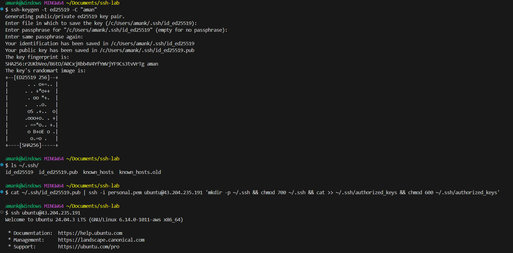

# Season 2 Day 13 Challenge - Solution

---

## Environment Details
- Server OS: Ubuntu 22.04  
- Client OS: AWS EC2 Linux (Ubuntu)  
- Server IP: `43.204.235.191`  
- SSH Port: Changed from `22` → `2222`

---

## Task A: Key-Based Authentication (Simple & Easy)

### What I Did:
1. Generated a new SSH key:
   ```bash
   ssh-keygen -t ed25519 -C "aman"
   ```
   - Pressed Enter for default location
   - Set a strong passphrase

2. Copied public key to server:
   ```bash
   cat ~/.ssh/id_ed25519.pub | ssh -i personal.pem ubuntu@43.204.235.191 'mkdir -p ~/.ssh && chmod 700 ~/.ssh && cat >> ~/.ssh/authorized_keys && chmod 600 ~/.ssh/authorized_keys'

   ```

3. Tested login with verbose output:
   ```bash
   ssh -vvv ubuntu@43.204.235.191 "echo OK && id -u && hostname"
   ```


---

## Task B: Harden SSH Server (The Right Way)

### What I Did:
1. Opened new port `2222` in firewall:
   ```bash
   sudo ufw allow 2222/tcp
   ```

2. Allowed inbound traffic for port 2222 in the security group of the EC2 instance

3. Edited `/etc/ssh/sshd_config`:
   ```conf
   Port 2222
   PermitRootLogin no
   PasswordAuthentication no
   PubkeyAuthentication yes
   AllowUsers your-username
   MaxAuthTries 3
   ClientAliveInterval 300
   ClientAliveCountMax 2
   LogLevel VERBOSE
   ```

4. Validated config:
   ```bash
   sudo sshd -t
   ```

5. Reloaded SSH service:
   ```bash
   sudo systemctl reload sshd
   ```

6. Tested connection on new port:
   ```bash
   ssh -p 2222 user@server-ip "echo PORT_OK"
   ```

7. Removed old port after success:
   ```bash
   sudo ufw delete allow 22/tcp
   ```

### Problem I Faced:
Even after changing the port and reloading SSH, I got a **"Connection refused"** error.

### Debugging Steps:
I ran:
```bash
sudo ss -tlnp | grep sshd
```
And saw that **SSH was still listening on port 22**, even though config said 2222.

Then I checked:
```bash
sudo systemctl status ssh
```
It was fine
```
### Fix That Worked:
I disabled the SSH socket by running below commands:
```bash
sudo systemctl stop ssh.socket
sudo systemctl disable ssh.socket
```
Then restarted:
```bash
sudo systemctl daemon-reload
sudo systemctl restart ssh
```

Now `ss -tlnp` showed:
```
LISTEN 0 128 0.0.0.0:2222 0.0.0.0:* users:(("sshd",pid=2002,fd=3))
```

Connection worked!

### Screenshot:
  


### Key Takeaway:
> **If you change SSH port but can't connect, check if a socket or external script is overriding your config.**  
> Use `ss -tlnp | grep sshd` to see what's actually listening.  
> Also check `/etc/systemd/system/ssh.service.d/` for custom configs.

---

## Task C: Secure File Transfer (Easy as Pie)

### What I Did:
1. Created test file:
   ```bash
   echo "hello-ssh" > hello.txt
   ```

2. Uploaded via SCP:
   ```bash
   scp -P 2222 hello.txt ubuntu@43.204.235.191:/tmp/hello.txt
   ```

3. Downloaded back:
   ```bash
   scp -P 2222 ubuntu@43.204.235.191:/tmp/hello.txt hello.remote.txt
   ```

4. Verified integrity:
   ```bash
   sha256sum hello.txt hello.remote.txt
   ```

Both files had the same hash. Transfer successful.

### Screenshot:
  
---

## Task D: SFTP-Only User (Optional)

### What I Did:
1. Created group and user:
   ```bash
   sudo groupadd sftpusers
   sudo useradd -m -G sftpusers -s /usr/sbin/nologin sftpuser
   sudo passwd sftpuser
   ```

2. Made chroot directory:
   ```bash
   sudo mkdir -p /sftp/sftpuser/upload
   sudo chown root:root /sftp /sftp/sftpuser
   sudo chmod 755 /sftp /sftp/sftpuser
   sudo chown sftpuser:sftpusers /sftp/sftpuser/upload
   ```

3. Added to `/etc/ssh/sshd_config`:
   ```conf
   Subsystem sftp internal-sftp
   Match Group sftpusers
       ChrootDirectory /sftp/%u
       ForceCommand internal-sftp
       AllowTCPForwarding no
       X11Forwarding no
   ```

4. Reloaded SSH and tested:
   ```bash
   ssh -p 2222 sftpuser@server-ip  # Failed → Good!
   sftp -P 2222 sftpuser@server-ip  # Worked → Perfect!
   ```

### Screenshot:
  

### Key Takeaway:
> Use `Match Group`, `ChrootDirectory`, and `ForceCommand` to lock users into SFTP only.  
> Never give shell access to upload-only users.

---

## Lessons Learned (Must Remember!)

1. **Never trust defaults** — always disable password login and root access.
2. **SSH keys are safer than passwords** — use them everywhere.
3. **Test new port BEFORE removing old one** — don’t get locked out!
4. **Check for hidden configs** — especially in `/etc/systemd/system/ssh.service.d/`.
5. **Use `ss -tlnp`** to see what ports are actually listening.
6. **Reload SSH, not restart** — unless needed.
7. **Validate config with `sshd -t`** before applying changes.
8. **Fix permissions early** — wrong `.ssh` perms cause silent failures.
9. **Use `scp` and `sftp`** instead of FTP — they’re secure and built-in.
10. **Test everything twice** — especially after firewall or port changes.

---

## Final Words

This challenge taught me that **SSH security is about layers**:
- Strong keys
- Tight config
- Proper firewall rules
- And knowing how to debug when things break

And remember:  
> **Always keep a second terminal open. Always backup configs. Always test before you remove.**

You’ll save yourself hours of stress. Trust me — I’ve been there.