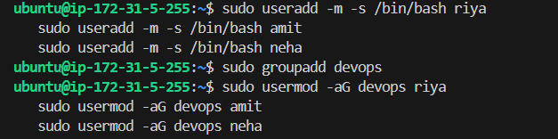
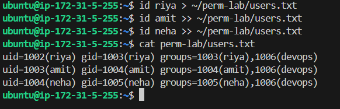
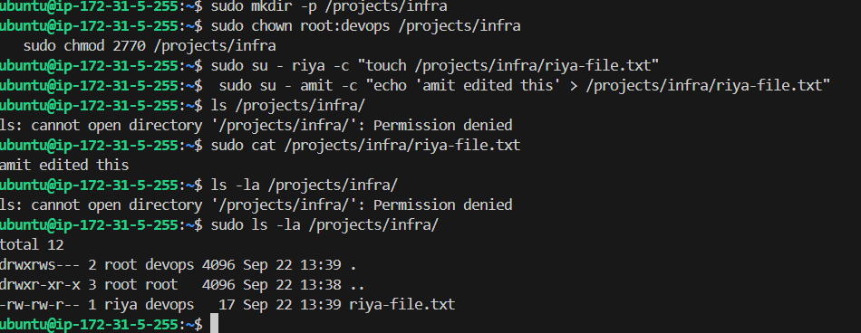
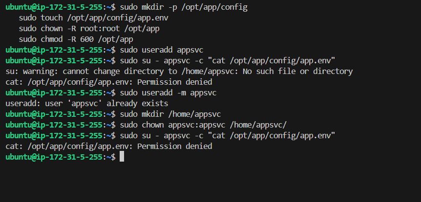
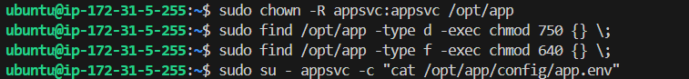
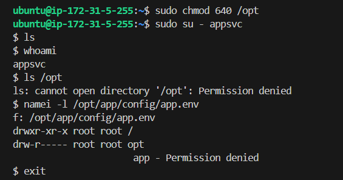

# Season 2 Day 14 Challenge - Solution

---

## 🧑‍💻 Task 1: Users and Groups — Done Right

### ✅ What I Did (Simple Steps):
```bash
sudo useradd -m -s /bin/bash riya
sudo useradd -m -s /bin/bash amit
sudo useradd -m -s /bin/bash neha

sudo groupadd devops

sudo usermod -aG devops riya
sudo usermod -aG devops amit
sudo usermod -aG devops neha

id riya
id amit
id neha
```

> Saved output to `~/perm-lab/users.txt`




### Key Things to Remember:
- `useradd -m` = creates home directory automatically (no extra step!)
- `usermod -aG` = **append** to group. Without `-a`, you wipe out other groups!
---

## 📁 Task 2: Team Directory — Shared, Secure, Smart

### ✅ What I Did:
```bash
sudo mkdir -p /projects/infra
sudo chown root:devops /projects/infra
sudo chmod 2770 /projects/infra  # ← Magic setgid bit!

# Test as team members:
sudo su - riya -c "touch /projects/infra/riya-file.txt"
sudo su - amit -c "echo 'amit edited this' > /projects/infra/riya-file.txt"

ls -la /projects/infra/
```

> Saved output to `~/perm-lab/teamspace.md`



### 💡 Key Things to Remember:
- `chmod 2770` = `2` is **setgid** → files inherit parent directory’s group (devops). Game-changer for teams.

---

## 🛠️ Task 3: Fix the Broken App — From Locked to Working

### ✅ What I Did:
```bash
# Broke it first (as instructed 😅)
sudo mkdir -p /opt/app/config
sudo touch /opt/app/config/app.env
sudo chown -R root:root /opt/app
sudo chmod -R 600 /opt/app

# Created appsvc user
sudo useradd appsvc

# Tried to access → Permission denied (expected!)



# Fixed it:
sudo chown -R appsvc:appsvc /opt/app
sudo find /opt/app -type d -exec chmod 750 {} \;
sudo find /opt/app -type f -exec chmod 640 {} \;

# Tested again → Success!
sudo su - appsvc -c "cat /opt/app/config/app.env"
stat /opt/app/config/app.env
```

> Saved commands + output to `~/perm-lab/appfix.md`



### 💡 Key Things to Remember:
- Use `find -type d` and `find -type f` to set permissions recursively but correctly.
- `750` for dirs (owner: rwx, group: rx, others: nothing)  
  `640` for files (owner: rw, group: r, others: nothing) → secure & functional.
---

## 🔍 Task 4: Troubleshooting — When Things Break Silently

### ✅ What I Did:
```bash
# Broke /opt on purpose:
sudo chmod 640 /opt

# Tried to access → Permission denied (even though app/ had good perms!)

# Used namei to find the culprit:
namei -l /opt/app/config/app.env

# Saw that /opt was missing 'x' permission!

# Fixed it:
sudo chmod 755 /opt

# Verified:
sudo su - appsvc -c "ls /opt/app/"
namei -l /opt/app/config/app.env
```




---
## 🎉 Challenge Completed.
