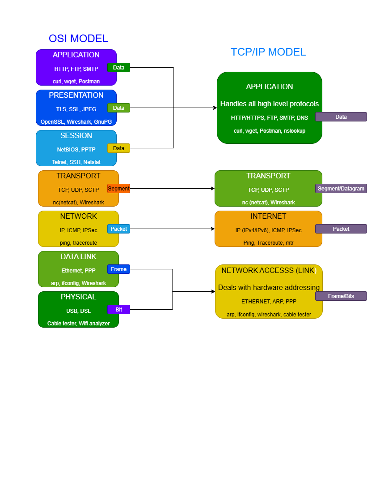

# Season 2 Day 15 Challenge: OSI & TCP/IP Models Challenge – Solution

## TASK 1: Combined OSI & TCP/IP Diagram

I created **one diagram** that shows both models together:

- Left side: **OSI 7-layer model** (Physical to Application)  
- Right side: **TCP/IP 4-layer model** (Network Access, Internet, Transport, Application)  
- Each layer includes:
  - Common **protocols** (e.g., HTTP, TCP, IP, Ethernet)
  - Relevant **tools** (e.g., ping, curl, arp)
  - **PDU names** (Bit, Frame, Packet, Segment, Data)
- Used **color coding** for clarity  
- Saved as both `.drawio` and `.png`



---

## TASK 2: Protocol & Tool Mapping Table

| Tool/Protocol | OSI Layer(s) | TCP/IP Layer        | Description |
|---------------|--------------|---------------------|-------------|
| `ping`        | 3            | Internet            | Tests IP reachability using ICMP |
| `ssh`         | 7            | Application         | Secure shell protocol |
| `dig`         | 7            | Application         | DNS lookup utility |
| `curl`        | 7            | Application         | HTTP/HTTPS client tool |
| `nc` (netcat) | 4            | Transport           | TCP/UDP connection utility |
| `ip addr`     | 2,3          | Network Access / Internet | Shows/configures network interfaces |
| `arp`         | 2            | Network Access      | Resolves IP to MAC address |
| `openssl`     | 6            | Application         | Handles SSL/TLS (Presentation layer) |
| `traceroute`  | 3            | Internet            | Traces route using ICMP/UDP |
| `tcpdump`     | 2,3,4,7      | Multiple            | Captures packets across layers |

---

## TASK 3: Mini Incident Response

**Problem**: Can’t reach `http://10.10.10.20:5000`. Ping fails, but DNS resolves.

**Diagnosis**:
- DNS works → Layer 7 is functional
- Ping fails → Layer 3 (IP connectivity) is broken
- Issue is **not** the web app or port 5000—it’s network-level

**Troubleshooting steps**:
```bash
# Check local interface (Layers 1–2)
ip link show
ip addr show

# Check routing and reachability (Layer 3)
ping 10.10.10.20
traceroute 10.10.10.20
ip route show
```

**Conclusion**: Since ping fails, the problem is likely:
- Target host is down
- No route to the destination
- Local/network firewall blocking traffic
- Incorrect IP/subnet configuration

No need to test port 5000 or HTTP until basic IP connectivity works.