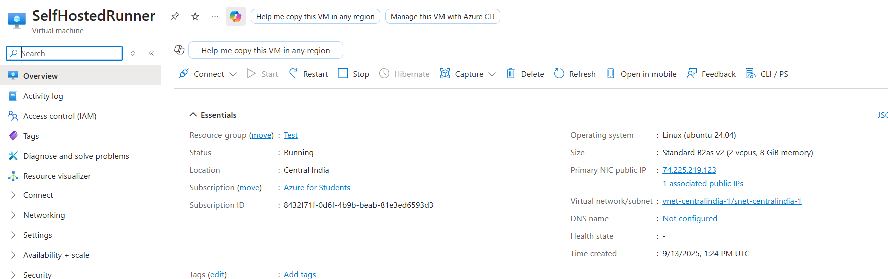
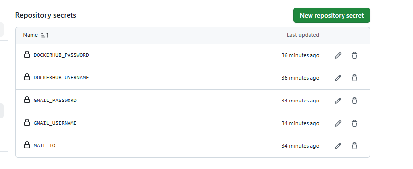
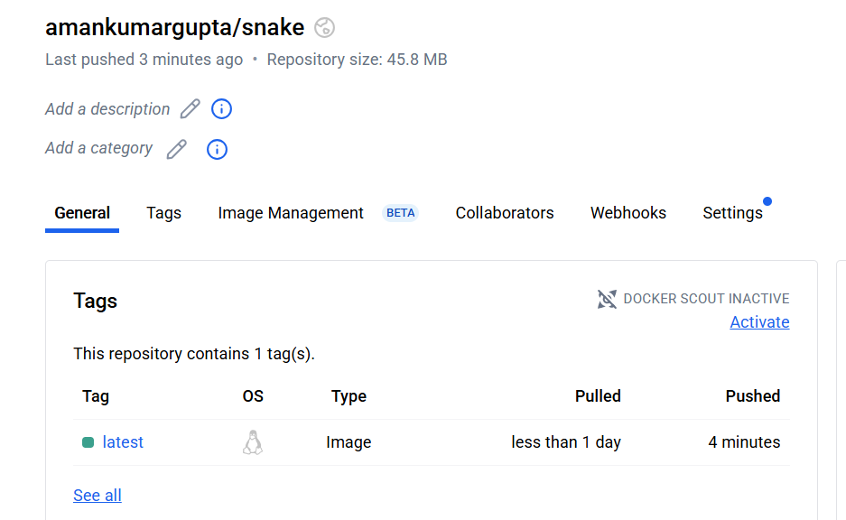
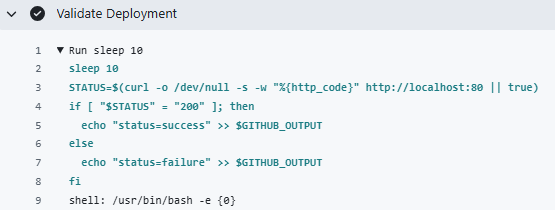
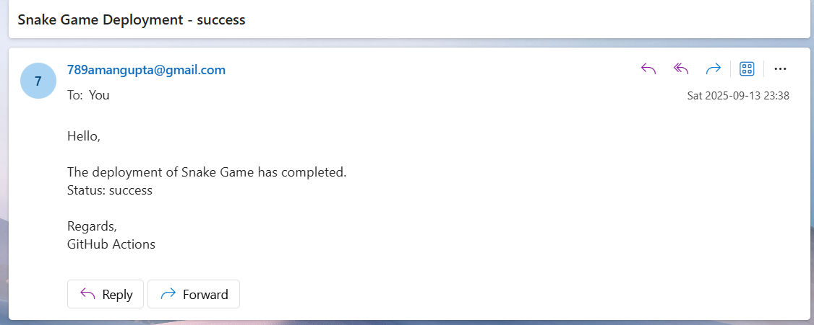
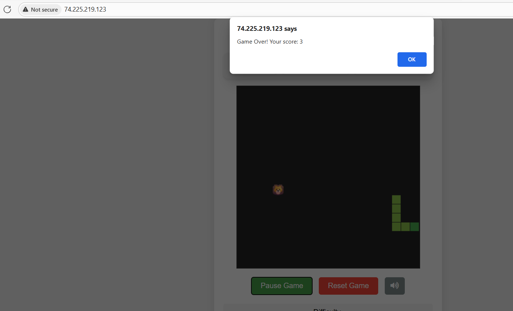
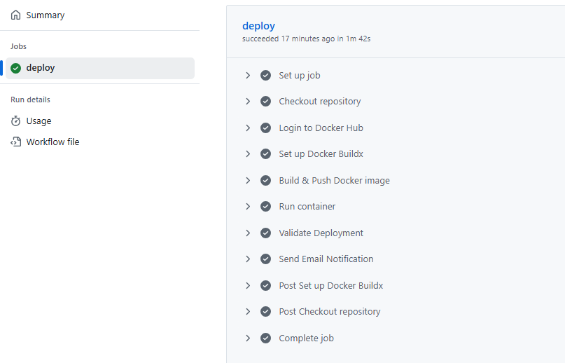

# Season 2 Day 7 Challenge - Solution

---

## Theory Answers

### 1. What is a GitHub runner?

A GitHub runner is basically a server that runs your GitHub Actions workflows. Think of it as a computer that automatically executes your code whenever you push changes to your repository. It can run tests, build your application, or deploy it to production.

### 2. How do self-hosted runners differ from GitHub-hosted runners?

GitHub-hosted runners are managed servers from GitHub - they provide the machine, but you have limited control and it costs money for private repos. Self-hosted runners are your own machines (like the EC2 instance we set up) - you manage them, but you get more control and can save money on larger projects.

### 3. What security considerations should you take when using self-hosted runners?

Keep your runner machine updated and secure since it can access your code. Don't use the same runner for public repositories if you're working on private projects. Make sure your EC2 security groups only allow necessary traffic, and consider using separate runners for different environments (like development vs production).

### 4. How can you scale self-hosted runners?

You can add more EC2 instances and set them up as additional runners. For automatic scaling, you can use AWS Auto Scaling Groups that spin up new runners when there are many workflow jobs waiting. You can also use runner labels to route different types of jobs to specific machines.

### 5. Can a single self-hosted runner be used for multiple repositories? Why or why not?

Yes, you can configure a single runner to work with multiple repositories in your organization. However, be careful because the runner will have access to code from all those repositories. It's often better to use separate runners for different projects to keep things isolated and secure.

# Practical Challenge Solution

## Step 1: Create a Virtual Machine

- Launch an Ubuntu 24.04 virtual machine (e.g., on Azure or AWS EC2).
- Allow inbound traffic on ports **22 (SSH)** and **80 (HTTP)**.



## Step 2: Configure GitHub Self-Hosted Runner

- Navigate to your **GitHub repository** → **Settings** → **Actions** → **Runners**.
- Click **"New self-hosted runner"**, select **Linux**, and follow the instructions to set it up.
- SSH into the VM and install the runner using the provided commands.
- Start the runner: `./run.sh`


## Step 3: Install Docker on the VM

Before setting up the workflow, install Docker on your VM:

```bash
sudo apt update
sudo apt install docker.io -y
sudo systemctl start docker
sudo systemctl enable docker
sudo usermod -aG docker ubuntu
```

Log out and log back in for the changes to take effect.

## Step 4: Set Up Repository & Secrets

- Fork the repository from [Sagar2366/season2-snake_game](https://github.com/Sagar2366/season2-snake_game)
- Add secrets in GitHub under **Settings → Secrets and variables → Actions**:
  - `DOCKERHUB_USERNAME`
  - `DOCKERHUB_PASSWORD`
  - `GMAIL_USERNAME`
  - `GMAIL_PASSWORD`
  - `MAIL_TO`



## Step 5: Create GitHub Actions Workflow

Create a workflow file that does the following:

1. **Builds the application** when code is pushed to the main branch
2. **Builds and pushes a Docker image** to Docker Hub



3. **Deploys the application on the self-hosted runner** by pulling and running the Docker container
4. **Validates that the application is running correctly** by checking if it responds on port 80



5. **Sends an email notification** about the deployment status



6. **Maps the container port to port 80** so the application is accessible via HTTP

## Step 6: Test the Deployment

- The workflow will automatically build, push, and deploy your application.
- Confirm the deployment by accessing `http://<vm-public-ip>` in a browser.



- If the workflow succeeds:



## Key Points to Remember

- Make sure your Dockerfile exposes the correct port.
- The workflow stops any existing container before deploying the new one.
- Email notifications will tell you if the deployment succeeded or failed.
- You can check container logs with `docker logs <container-name>` if something goes wrong.

That's it! Your application will now automatically deploy whenever you push changes to your repository.